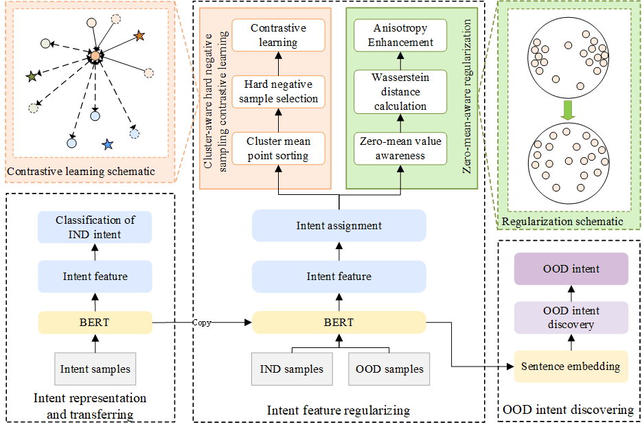

# **Learning Isotropy-Aware Representations for Out-of-domain Intent Discovery**

## Introduction
This repository provides the official PyTorch implementation of the research paper 'Learning Isotropy-Aware Representations for Out-of-domain Intent Discovery'

### Dependencies 

We use anaconda to create python environment:
```
conda create --name python=3.9
```
Install all required libraries:
```
pip install -r requirements.txt
```

## Model Preparation
Get the pre-trained [BERT](https://storage.googleapis.com/bert_models/2018_10_18/uncased_L-12_H-768_A-12.zip) model and convert it into [Pytorch](https://huggingface.co/transformers/converting_tensorflow_models.html). 

Set the path of the uncased-bert model (parameter "bert_model" in init_parameter.py).
## Datasets
Datasets derived from public resources and made available with the article.

Banking: [https://github.com/PolyAI-LDN/task-specific-datasets](https://github.com/PolyAI-LDN/task-specific-datasets).

CLINC: [https://github.com/clinc/oos-eval](https://github.com/clinc/oos-eval).

StackOverflow: [https://github.com/jacoxu/StackOverflow](https://github.com/jacoxu/StackOverflow).
## Usage
Run the experiments by: 
```
bash run.sh
```
## Model
The model architecture of Our method:




## Thanks && Acknowledgments
Our code implementation is on the basis of https://github.com/zyh190507/Probabilistic-discovery-new-intents. Our baseline is [A Probabilistic Framework for Discovering New Intents](https://aclanthology.org/2023.acl-long.209) (Zhou et al., ACL 2023), DOI: [10.18653/v1/2023.acl-long.209](https://doi.org/10.18653/v1/2023.acl-long.209)
